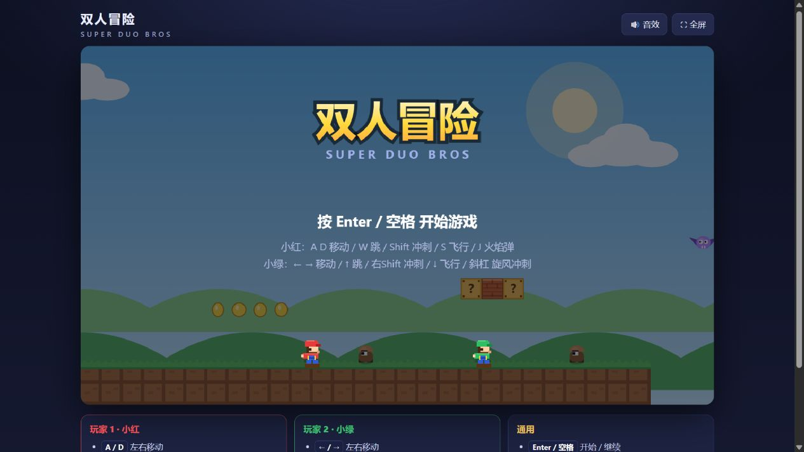
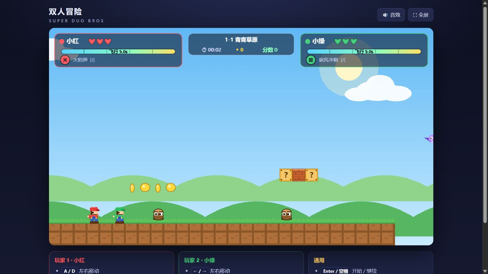

# 双人冒险 · Super Duo Bros（网页端 Demo）

一个纯前端、零依赖的双人横版闯关 Demo。**双击 `index.html` 即可运行**（不需要装任何东西，也不需要本地服务器）。




## 玩法特性

| 特性 | 说明 |
| --- | --- |
| 同屏双人 | 一台键盘两个人玩，镜头自动跟随并会随两人拉开距离缩小 |
| 冲刺加速跑 | 按住冲刺键，最高速度约提升 70%，起跳距离明显变远，带残影与尘土 |
| 飞行（最多 5 秒） | 长按飞行键起飞，能量条 5 秒耗尽；落地缓慢回充，吃金币可立刻补 0.8 秒 |
| 大跳 / 小跳 | 轻点 = 小跳，按住 = 大跳（最高约 6 格），含土狼时间与跳跃缓冲手感优化 |
| 专属技能 | P1 火焰弹（远程消灭敌人）；P2 旋风冲刺（无敌突进、撞击消灭敌人） |
| 关卡 | 2 张手工关卡：青草原（白天）与熔岩夜窟（夜晚），含金币、问号砖、弹簧、尖刺、熔岩、坑洞 |
| 生命与复活 | 每人 3 颗心，受伤无敌帧；倒地 8 秒后自动复活，两人同时倒地则结束 |

## 操作

**玩家 1 · 小红**

- `A` / `D` 左右移动
- `W` 跳跃（轻点小跳 / 长按大跳）
- `Shift`（左）冲刺
- `S` 长按飞行
- `J` 技能：火焰弹

**玩家 2 · 小绿**

- `←` / `→` 左右移动
- `↑` 跳跃（轻点小跳 / 长按大跳）
- `Shift`（右）或小键盘 `0` 冲刺
- `↓` 长按飞行
- `/` 技能：旋风冲刺

**通用**：`Enter`/空格 开始与继续，`P`/`Esc` 暂停，`R` 重开本关，`M` 静音。

## 开发小工具

- 游戏对象挂在 `window.game` 上，打开浏览器控制台即可实时调参、看状态。
- 按 `F3`（或在网址后加 `?debug=1`）会打开左下角调试面板，实时显示两人坐标、速度、飞行能量、技能冷却与镜头缩放。
- 所有手感参数都在 `js/config.js`，改完刷新即可生效。

## 文件结构

```
duo-bros/
├─ index.html      页面与操作说明
├─ styles.css      页面样式
├─ js/
│  ├─ config.js    所有手感参数（重力、速度、飞行时长等，改这里调手感）
│  ├─ input.js     键盘输入（边沿检测 / 缓冲）
│  ├─ audio.js     WebAudio 音效合成（无音频文件）
│  ├─ level.js     关卡数据与关卡生成器
│  ├─ entities.js  玩家、敌人、火球、粒子、瓦片碰撞
│  ├─ render.js    像素风绘制与 HUD
│  └─ game.js      主循环、镜头、游戏流程
├─ tools/
│  ├─ simtest.js   无头物理仿真测试（node tools/simtest.js）
│  └─ rendertest.js 渲染冒烟测试（node tools/rendertest.js）
└─ README.md
```

想改手感直接看 `js/config.js`，比如 `FLY_MAX = 5.0` 就是飞行上限秒数，`SPRINT_MAX` 是冲刺最高速度。

改完参数建议跑一次回归：`node tools/simtest.js`（27 项玩法断言）与 `node tools/rendertest.js`（全部绘制路径）。
